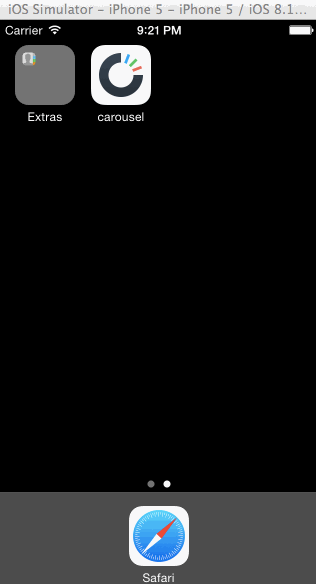

carousel
========

Time Spent: 7.5 hours total.

* [x] Static photo tiles on the initial screen
      * [x] Optional: Photo tiles move with scrolling - not quite, but was the best I could do
      
* [x] Sign In
      * [x] Tapping on email/password reveals the keyboard (and shifts the scrollview and Sign In button up) 
      * [x] User sees an error alert when no email is present or no password is present.
      * [x] User sees a loading screen upon tapping the Sign In button.
      * [x] User sees an error alert when entering the wrong email/password combination.
      * [x] User is taken to the tutorial screens upon entering the correct email/password combination.
      
* [x] Tutorial Screens
      * [x] User can page between the screens
      * [x] Optional: User can page between the screens with updated dots
      * [x] Optional: Upon reaching the 4th page, hide the dots and show the "Take Carousel for a Spin" button.
      
* [x] Image Timeline
      * [x] Display a scrollable view of images.
      * [x] User can tap on the conversations button to see the conversations screen (push).
      * [x] User can tap on the profile image to see the settings view (modal from below).
      
* [x] Settings
      * [x] User can dismiss the settings screen.
      * [x] User can log out

